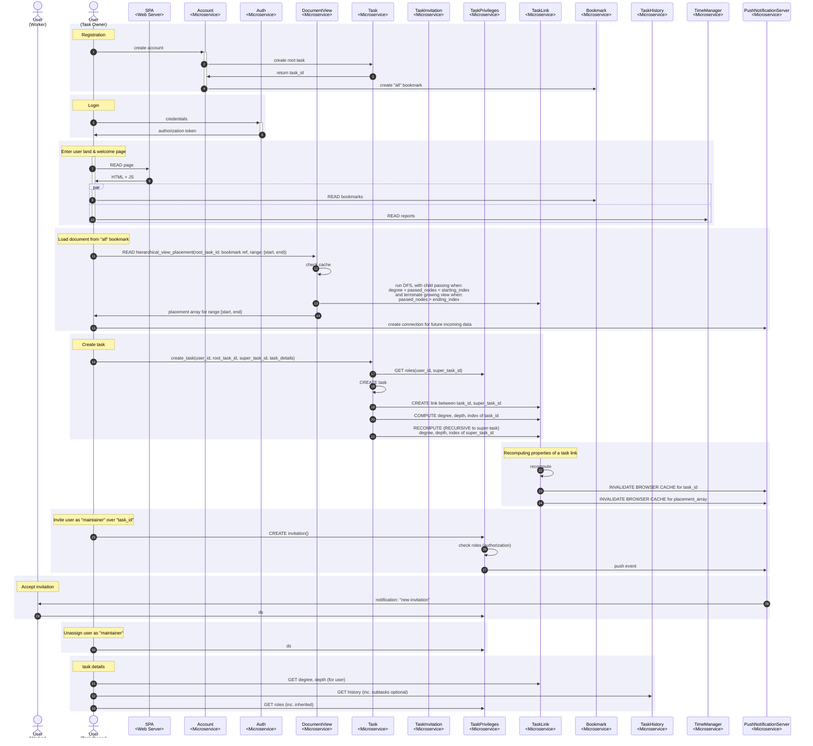

```mermaid
sequenceDiagram
autonumber

actor collab as User<br>(Worker)
actor owner as User<br>(Task Owner)

participant spa as SPA<br><Web Server>
participant account as Account<br><Microservice>
participant auth as Auth<br><Microservice>
participant view as DocumentView<br><Microservice>
participant task as Task<br><Microservice>
participant invitation as TaskInvitation<br><Microservice>
participant privilege as TaskPrivileges<br><Microservice>
participant taskLink as TaskLink<br><Microservice>
participant bookmark as Bookmark<br><Microservice>
participant history as TaskHistory<br><Microservice>
participant timemngr as TimeManager<br><Microservice>

participant push as PushNotificationServer<br><Microservice>

rect rgb(240,240,250)
  Note over owner: Registration
  owner ->>+ account: create account
  account ->> task: create root task
  task ->> account: return task_id
  account ->>- bookmark: create "all" bookmark
end

rect rgb(240,240,250)
  Note over owner: Login
  owner ->>+ auth: credentials
  auth ->>- owner: authorization token
end

rect rgb(240,240,250)
  Note over owner: Enter user land & welcome page
  activate owner
  owner ->> spa: READ page
  spa ->> owner: HTML + JS
  par
  	owner ->> bookmark: READ bookmarks
  and
  	owner ->> timemngr: READ reports
  end
  deactivate owner
end

rect rgb(240,240,250)
  Note over owner: Load document from "all" bookmark
  owner ->>+ view: READ hierarchical_view_placement(root_task_id: bookmark ref, range: [start, end))
  view ->> view: check cache
  view ->> taskLink: run DFS, with child passing when:<br>degree + passed_nodes < starting_index<br>and terminate growing view when:<br>passed_nodes > ending_index
  view ->> owner: placement array for range [start, end)
  owner ->> push: create connection for future incoming data
end


rect rgb(240,240,250)
	note over owner: Create task
	owner ->> task: create_task(user_id, root_task_id, super_task_id, task_details)
	task ->> privilege: GET roles(user_id, super_task_id)
	task ->> task: CREATE task
	task ->> taskLink: CREATE link between task_id, super_task_id
	task ->> taskLink: COMPUTE degree, depth, index of task_id
	task ->> taskLink: RECOMPUTE (RECURSIVE to super-task)<br>degree, depth, index of super_task_id
end

rect rgb(240,240,250)
  Note over taskLink: Recomputing properties of a task link
	taskLink ->> taskLink: recompute
	taskLink ->> push: INVALIDATE BROWSER CACHE for task_id
	taskLink ->> push: INVALIDATE BROWSER CACHE for placement_array
end

rect rgb(240,240,250)
	note over owner: Invite user as "maintainer" over "task_id"
	owner ->> privilege: CREATE invitation()
	privilege ->> privilege: check roles (authorization)
	privilege ->> push: push event
end

rect rgb(240,240,250)
	note over collab: Accept invitation
	push ->> collab: notification: "new invitation"
	collab ->> privilege: ds
end

rect rgb(240,240,250)
	note over owner: Unassign user as "maintainer"
	owner ->> privilege: ds
end

rect rgb(240,240,250)
  Note over owner: task details
  owner ->> taskLink: GET degree, depth (for user)
  owner ->> history: GET history (inc. subtasks optional)
  owner ->> privilege: GET roles (inc. inherited)
end


```
