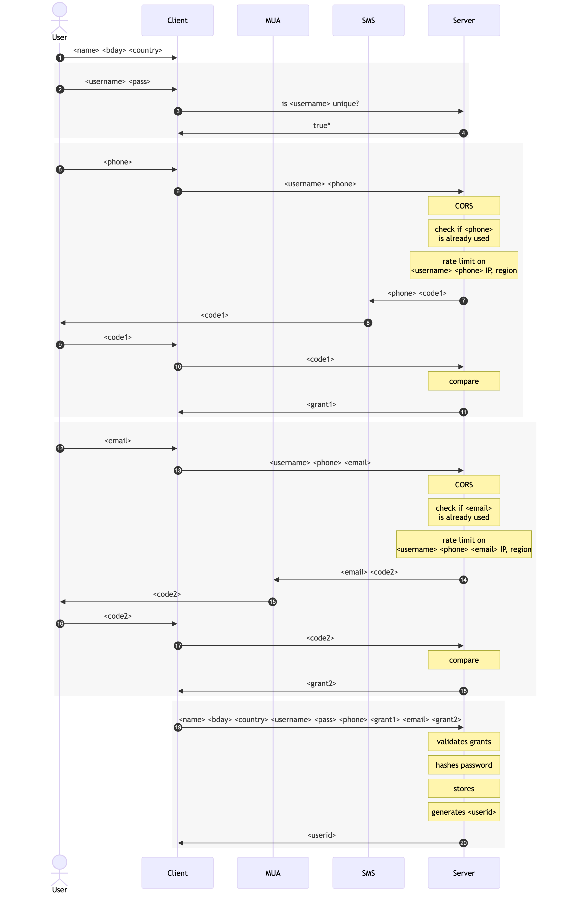

# Procedures

## Signup

Resources:

- https://www.reddit.com/r/SoftwareEngineering/comments/1101l5g/comment/j86hxjm/

## Changing email address

- Owner of the old email address can restore the change for 2 weeks. This is a measure against account takeover and can not be shortened.

## New logins

- A session that is shorter than 1 day can not edit login details.
