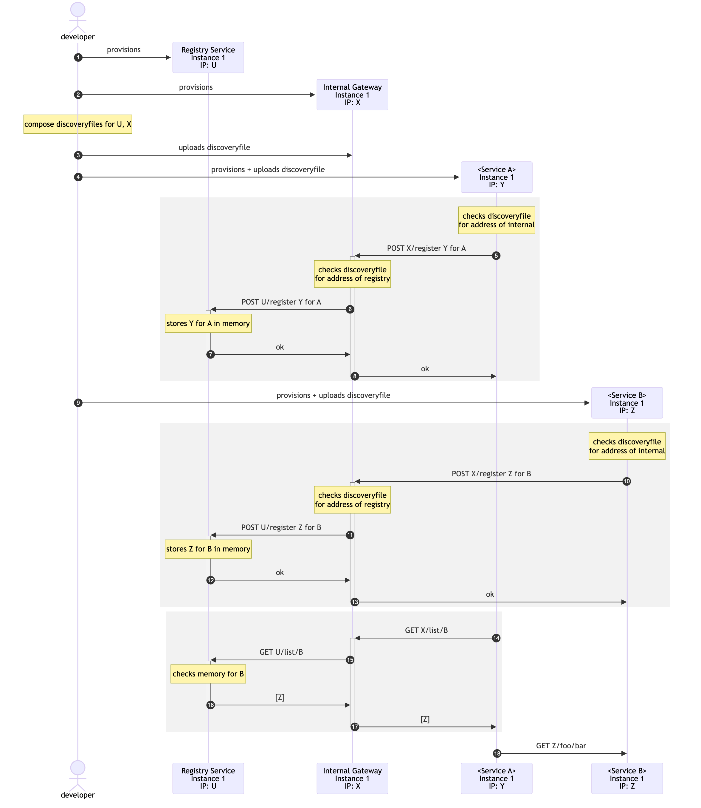
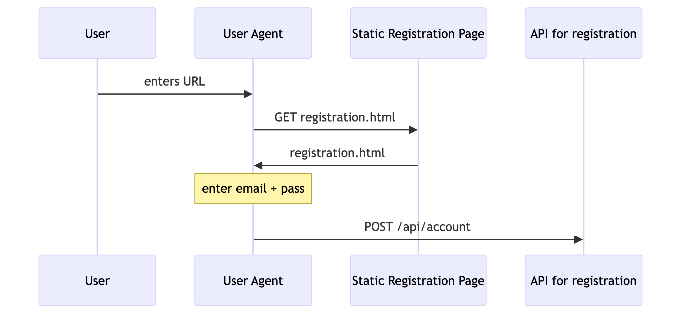
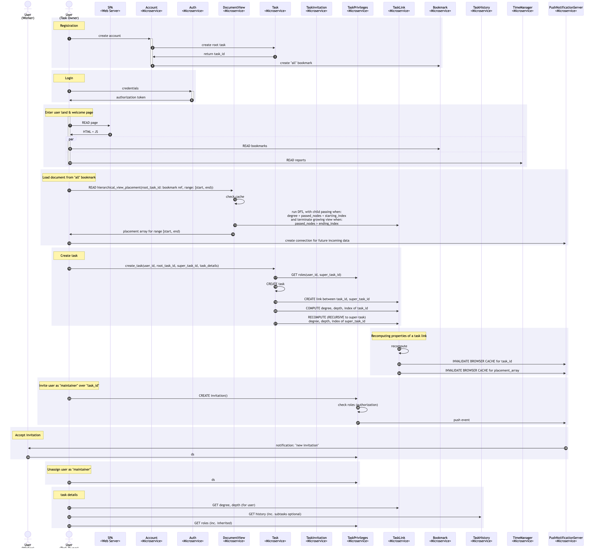
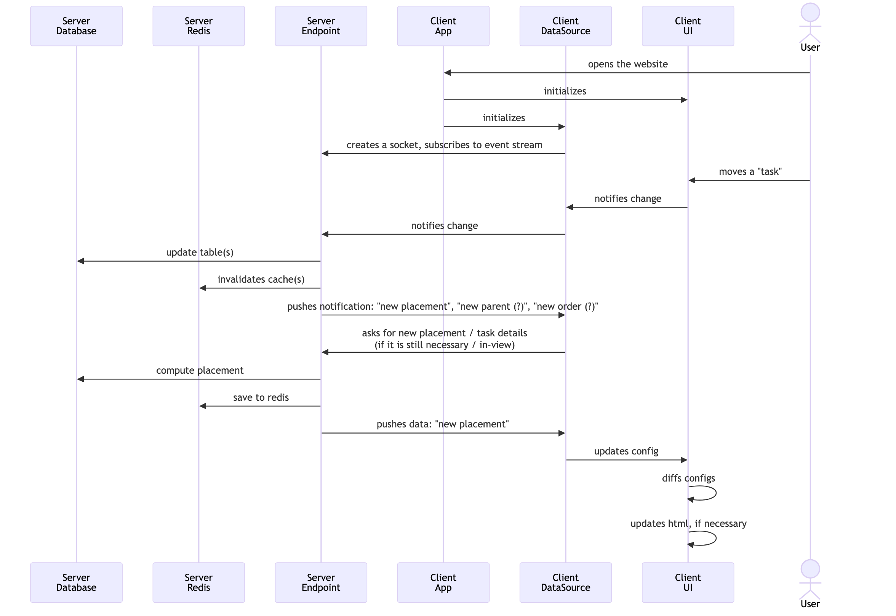

# App

## Service discovery

Design constraints:

- Discovery by **configuration** doesn't scale. Discovery by **self-registration** needs discovery service's address to be known at start.

Design:

- `discovery file` contains addresses of `discovery service` and `internal gateway` instances 

- `discovery file` gets uploaded into `internal gateway` and other service instances by developer (manual process)

- Service instances find addresses of `internal gateway` instances eventually from `discovery file` 

- Service instances self-registers themselves by sending a `POST internal/discovery/register` request to internal gateway with body:
  ```json
  {
    "service": "account",
    "ip": "10.140.0.10",
    "port": 56876
  }
  ```
 
- `internal gateway` duplicates and sends the `POST /register` request to **all instances** of `discovery service` instances

- Services use `internal/web/discovery.ConfigBasedServiceDiscovery` to read `discovery file` and list available instances of the service in need.


Pros:

- The only manual process, file upload only needed when either of `discovery service` or `internal gateway` instances change, which occurs less frequently than change of other service instances.

Cons:

- Every instance provision now also requires a file upload. (managable)



## Anti-CSRF Token generation



## Server-Client Communication



## Placement Cache

- Invalidation
- Re-computation
- Notification



