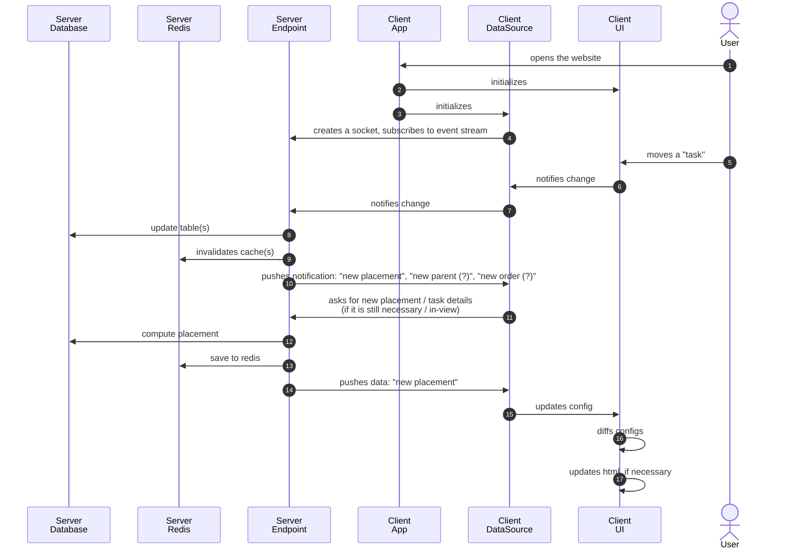
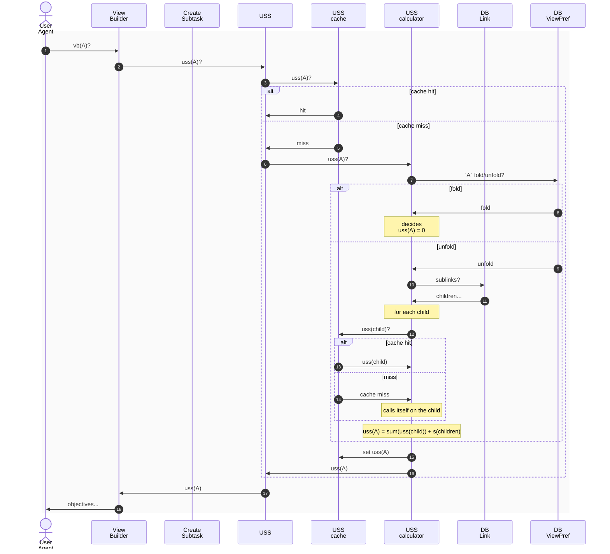

# Document

## Placement cache

- Invalidation
- Re-computation
- Notification

```mermaid
sequenceDiagram
autoNumber

participant db as Server<br>Database
participant rd as Server<br>Redis
participant ep as Server<br>Endpoint
participant a as Client<br>App
participant ds as Client<br>DataSource
participant ui as Client<br>UI
actor u as User

u->>a: opens the website
a->>ui: initializes
a->>ds: initializes
ds->>ep: creates a socket, subscribes to event stream

u->>ui: moves a "task"
ui->>ds: notifies change
ds->>ep: notifies change
ep->>db: update table(s)
ep->>rd: invalidates cache(s)

ep->>ds: pushes notification: "new placement", "new parent (?)", "new order (?)"
ds->>ep: asks for new placement / task details<br>(if it is still necessary / in-view)
ep->>db: compute placement
ep->>rd: save to redis
ep->>ds: pushes data: "new placement"

ds->>ui: updates config
ui->>ui: diffs configs
ui->>ui: updates html, if necessary
```

## Unfold subtree size

```mermaid
sequenceDiagram
autonumber

actor ua as User<br>Agent
participant vb as View<br>Builder
participant cs as Create<br>Subtask
participant uss as USS
participant cache as USS<br>cache
participant calc as USS<br>calculator
participant lnk as DB<br>Link
participant vp as DB<br>ViewPref

rect rgba(128,128,128,0.04)
  ua->>vb: vb(A)?
  vb->>uss: uss(A)?
  uss->>cache: uss(A)?
  alt cache hit
    cache->>uss: hit
  else cache miss
    cache->>uss: miss
    uss->>calc: uss(A)?
    calc->>vp: `A` fold/unfold?
    alt fold
      vp->>calc: fold
      note over calc: decides<br>uss(A) = 0
    else unfold
      vp->>calc: unfold
      calc->>lnk: sublinks?
      lnk->>calc: children...
      note over calc: for each child
      calc->>cache: uss(child)?
      alt cache hit
        cache->>calc: uss(child)
      else miss
        cache->>calc: cache miss
        note over calc: calls itself on the child
      end
      note over calc: uss(A) = sum(uss(child)) + s(children)
    end
    calc->>cache: set uss(A)
    calc->>uss: uss(A)
  end
  uss->>vb: uss(A)
  vb->>ua: objectives...
end
```
