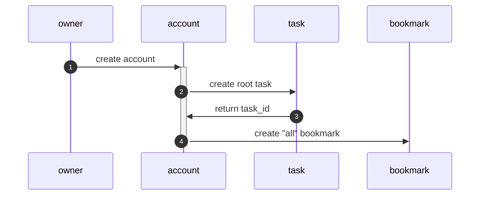
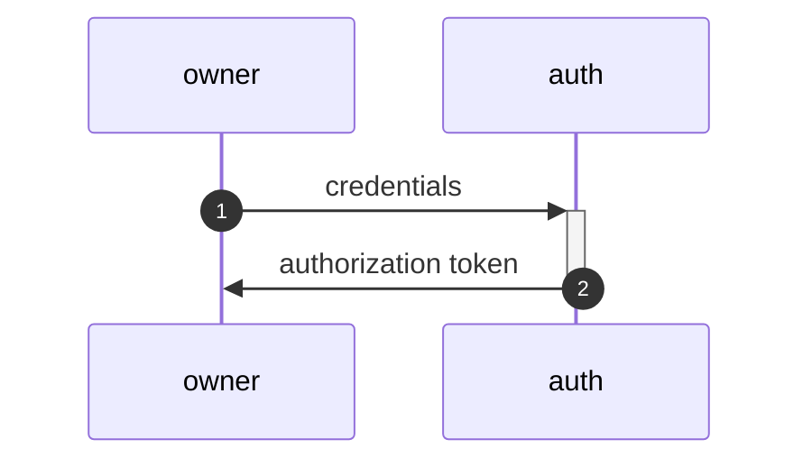
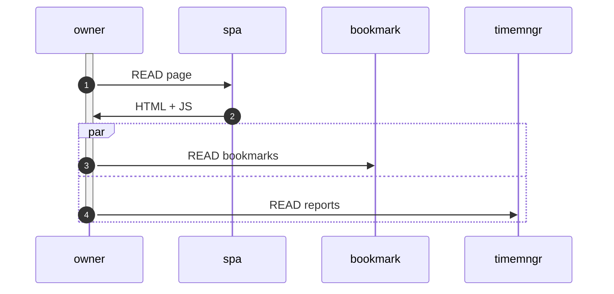
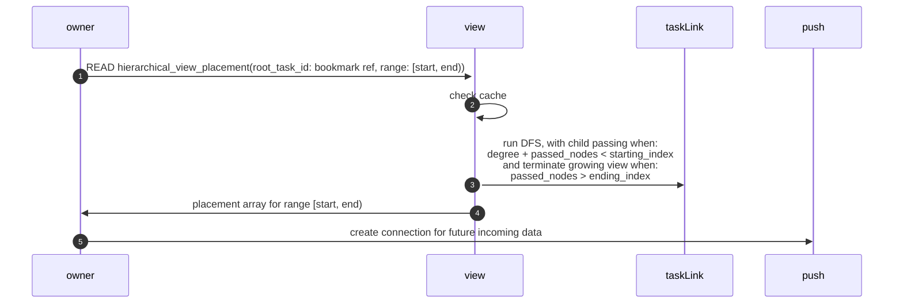
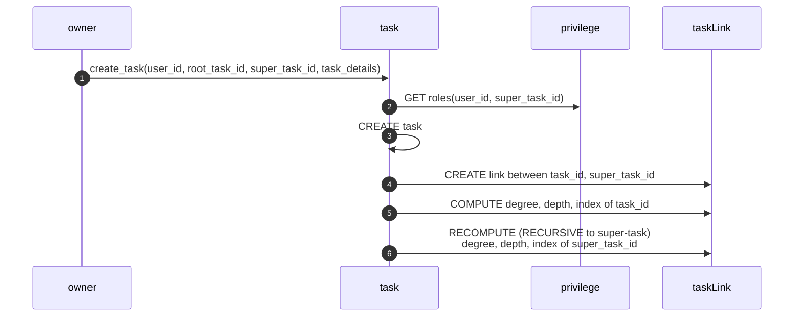
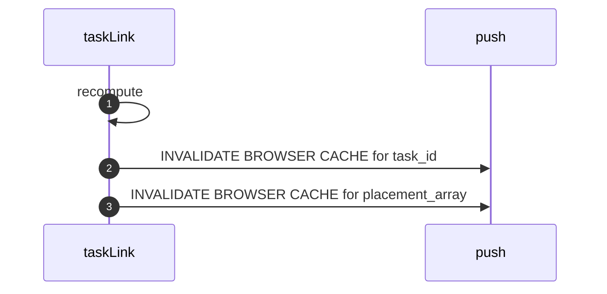
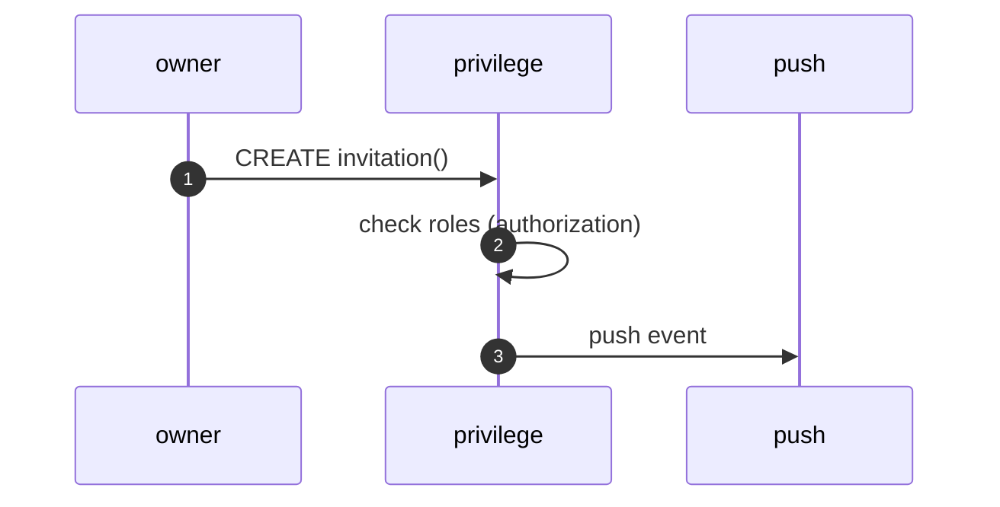
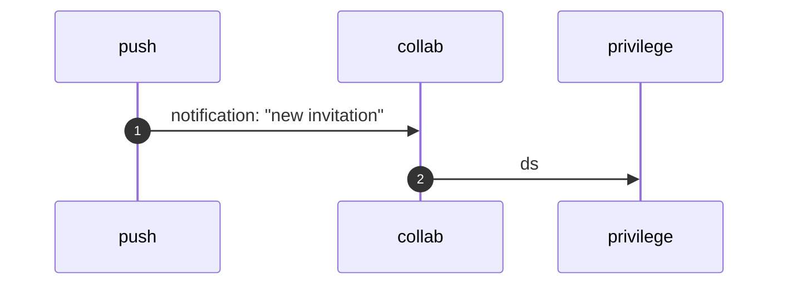
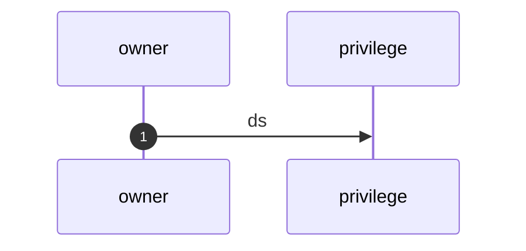
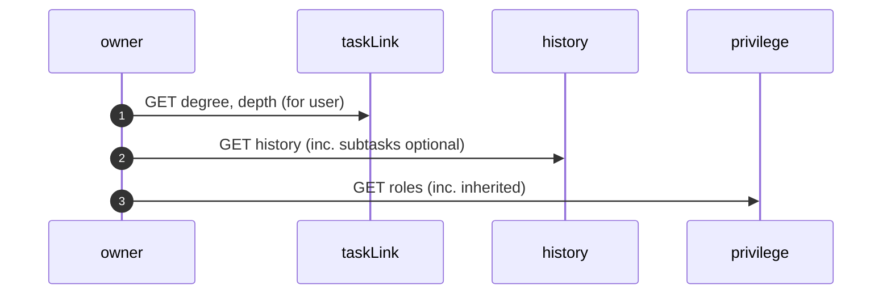

# Server — Client

> | Kind       | Item       | Description              |
> | ---------- | ---------- | ------------------------ |
> | Service    | account    | Account                  |
> | Service    | auth       | Auth                     |
> | Service    | bookmark   | Bookmark                 |
> | Service    | history    | Task History             |
> | Service    | invitation | Task Invitation          |
> | Service    | privilege  | Task Privileges          |
> | Service    | push       | Push Notification Server |
> | Service    | task       | Task                     |
> | Service    | taskLink   | Task Link                |
> | Service    | timemngr   | Time Manager             |
> | Service    | view       | Document View            |
> | User       | collab     | Worker                   |
> | User       | owner      | Task owner               |
> | Web server | spa        | SPA                      |

## Registration

## Login

## Enter user land & welcome page

## Load document from `all` bookmark

## Create task

## Recomputing properties of a task link

## Invite user as `maintainer` over `task_id`

## Accept invitation

## Unassign user as `maintainer`

## task details

