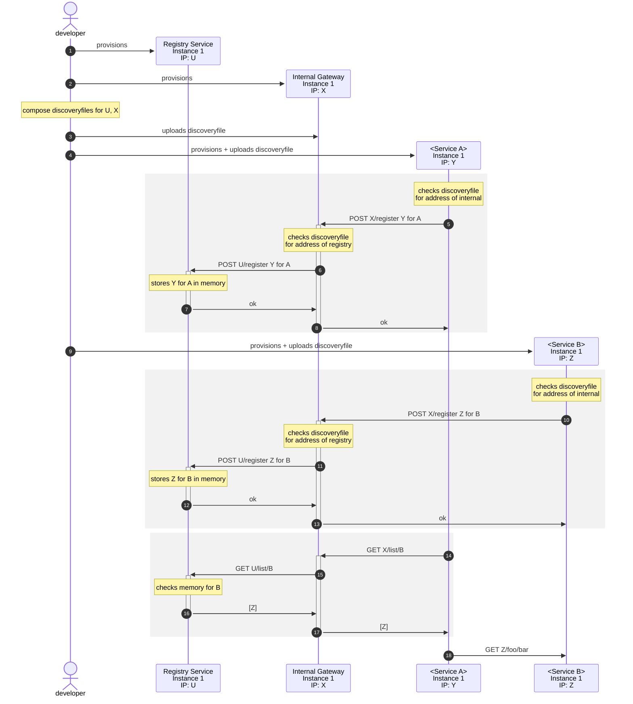

# Service discovery

Design constraints:

- Discovery by **configuration** doesn't scale. Discovery by **self-registration** needs registry service's address to be known at start.

Design:

- `discovery file` contains addresses of `registry service` and `internal gateway` instances

- `discovery file` gets uploaded into `internal gateway` and other service instances by developer (manual process)

- Service instances find addresses of `internal gateway` instances eventually from `discovery file`

- Service instances self-registers themselves by sending a `POST internal/servicereg/register` request to internal gateway with body:

  ```json
  {
    "service": "account",
    "ip": "10.140.0.10",
    "port": 56876
  }
  ```

- `internal gateway` duplicates and sends the `POST /register` request to **all instances** of `registry service` instances

- Services use `internal/web/discovery.ConfigBasedServiceDiscovery` to read `discovery file` and list available instances of the service in need.

Pros:

- The only manual process, file upload only needed when either of `registry service` or `internal gateway` instances change, which occurs less frequently than change of other service instances.

Cons:

- Every instance provision now also requires a file upload. (managable)
- `internal gateway` and `registry service` instances can listen only predefined ports, runtime selection is unallowed. Thus, only one process per address is possible for those.

Improvement opportunities:

- Enable the persistency among `registry service` instances by a hash ring. To remove the need of `internal gateway` to duplicate & forward each registration and recheck request.


