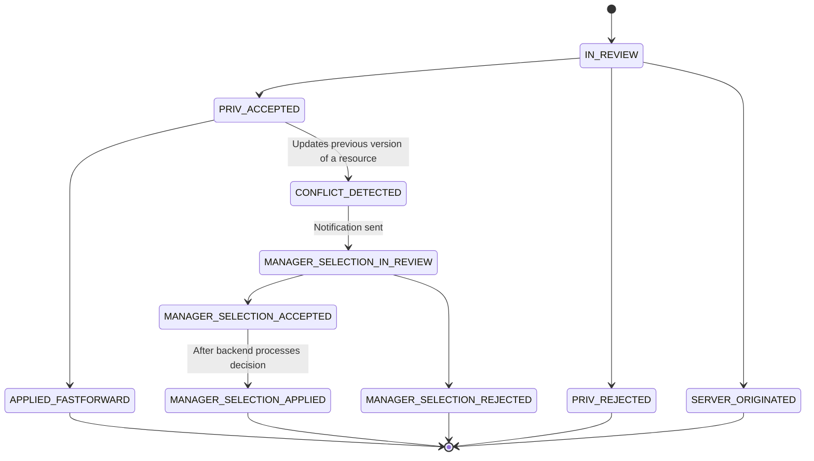

# Diagrams

> **In this document:**
>
> -   User-level functions of the product
> -   Foundation for internal data structure. Interactions between them.
>
> **NOT in this document**
>
> -   API definitions, endpoints
> -   Client/server separation
>
> **Don't forget:**
>
> At each change on software, update this document accordingly in order to making future development easier. Blind spots on past work eventually will scare developers to bring new features that creates conflict with previous ones.

## Public

**Create account**

1. Security measures

    1. Salt + hash
    1. CSRF
    1. e-mail activation

1. At database:
    1. Create record on `USER` table
    1. Create root task on `TASK` with `user_id`
    1. Create "all" bookmark in `BOOKMARK` table with `task_id`

**Delete account**

1. Those functions requires authorization to access.

**Login**

1. MultiFactor login flow
   1. Client should ask 

## Authorization required

**New operation**

1. Parameters: **user_id, task_id, operation_type, operation_details ➝ status**
1. Check permissions accordingly to definitions of each operation
1. Use credits of user or collaboration
1. Create an entry on mq for related service to pick up request and execute

**Using credits**

1. Parameters: **user, task, operation ➝ status**
1. When task **has** credit balance: pay from balance
    1. When multiple balances added to collaboration:
        1. Consume from the oldest package.
1. When task **has no** credit balance: user pays
1. In lack of enough credit: return failure

**Create websocket**

1. Client creates a websocket to API and keep it open.
1. Whenever a cache invalidation happened (as side effect of a request), server pushes a notification by websocket.

**Create a bookmark**

1. Parameters: **user_id, task_id, bookmark_name ➝ status**
1. bookmark value is null for root bookmark (named as "All")
1. check permissions:
    1. user login is same with bookmark creator and bookmark owner

**Create a task**

1. Parameters: **creator_user, text_content, root_task (for sharding), super_task ➝ output: error?**

1. Check user role, minimum role to allow break-down: "creator", "collaborator"
1. Create `TASK_RELATION`, `TASK_HISTORY` and `USER_ROLES_FOR_TASKS` records
1. Credit usage
1. Create DB record in the same shard wih supertask.

**Reattach a task**

1. Parameters: **user_id, task_id, new_super_task ➝ status**
1. Permissions: manager, inherited-manager, inherited-creator, creator on both task and supertask

**Update task content**

1. Parameters: user_id, 

**Wrap tasks with a supertask**

1. Parameters: **creator_user, []tasks, supertask ➝ super_task_id, status**
1. Move collaboration details to supertask: assignments etc.

**Archive a task**

1. Parameters: **user_id, task_id ➝ status**
1. Permission required: 

**Subtasks of a task**  

1. Check permissions on all subtasks of a task. User should have at least "collaborator" or "creator"

**Supertask of a task**

> A task can have only one supertask per user. So, for each user who views the task, the supertask could be different.

1. Parameters: **user_id, task_id ➝ []task_id, error**
1. Return every sub-task of given task that the user has at least viewership rights on it.

**Compute completion percentage**

1. if there is change in completion percentage of the task
    1. re-call `self` for super-task(s)

**Mark task done/undone**

1. Parameters: **user_id, task_id, done/undone ➝ error**
1. check permissions:
    1. commander should be at least "collaborator" or "owner" of marked task
1. invalidate cache for task changed status and supertasks completion percentage changed

**Hierarchical view placement**

1. Parameters: **user_id, root_task_id, start_index, end_index ➝ []task_id, error**
1. Start DFS algorithm from root_task_id
   1. Use index column values to order children
   1. Don't collect nodes that are:
      1. archived
      1. folded
         1. when there is no record for folding preference for user, assume unfolded
      1. Add degree of each node passed into $\text{collected nodes}$
   1. Pass nodes that are out of ranges:
      1. $\text{collected nodes} + \text{degree} < \text{start index}$
      1. $\text{collected nodes} \ge \text{end index}$

### Notes / Attachments

**Create attachments**

**List attachments**

### History

**Universal undo/redo**

- Permission: manager, creator

**Get revisions of a task**

- Permission: manager, inherited-manager, creator, inherited-creator, collaborator

**Checkout to a revision**

- Permission: manager, inherited-manager, creator, inherited-creator

### Takes

**Create session for new take creation**

1. Parameters: **user_id, task_id ➝ status**
1. Permission: owner

### Collaboration

**Assign credits**

1. Parameters: **user_id, task_id, credits ➝ status**
1. Permissions: creator
1. Reduce assigned credits from account credits.

**Assign user**

1. Parameters: **commander_user, assigned_user, task ➝ status**
1. Check permissions:
    1. Commander is either "creator" or "collaborator"
1. Check credit for maximum collaborator, and use
1. If this assignment enables collaboration on the task for the first time, than isSolo = false for the task and its subs.
1. If `assigned_user` is not already have same role in inherited way; run "create invitation"

**Create invitation**

**Accepting invitation**

- Invited user must be able to review details about collaboration before accepting an invitation.
  - Root task name (invited task is root task)
  - If it is available: display assigned credits.
- Invited user must be given option to attach the root task of invitation to its document. Either case, create a bookmark for root task.

**Unassign user**

1. Check permissions:
    1. Commander is either "creator" or "collaborator"
2. When "unassigned_user" have "creator" role at unassigned task tree; it looses that role, ownership should transferred to a manager.  

**Restrict user**

1. Parameters: **commander_user, restricted_user, task, clear_subtasks(bool) ➝ status**
1. Check permissions:
    1. Manager can not be restricted
    1. Commander is either "creator" or "collaborator"
    1. Commander should be on higher level than restricted user as joining task to collaboration
1. Remove assignments on subtasks if clear_subtasks is given `True`.

**Derestrict user**

1. Parameters: **commander_user,  restricted_user,  task,  clear_subtasks(bool) ➝ status**
1. Check permissions: 
    1. Commander is either "creator" or "collaborator"

**Quit**

> Any assigned user can drop its roles and quit from collaboration.

1. Parameters: **user_id, task_id ➝ status**
1. Check permissions: 
1. List undertook roles on and below task
1. Create record for listed roles in DB as pending new user.

**Check roles**

1. Going bottom-up; return to callee at the first assignment/restriction point.
    1. Follow inheritance links to go 1 level up at each step.
    1. Ignore: not accepted assignment invitations.
    1. Ignore: 

1. Direct relationship
    1. Owner
        1. User owns solo-tasks.
        1. User owns tasks created by itself.
    1. Collaborator
1. Indirect relationship
    1. inherited roles in-collaboration (from parent(s))

### Chat

**Aggregated view**

- Params: **user_id, task_id, aggregation_level ➝ []message, error**

**New message**

1. Check permissions: "Contributor"

### Proposal

**Create proposal**

1. Present notice user is creating a proposal. with buttons to revert and switch to common copy.
1. As user makes modifies document, client sends those operations as usual but with notice of id of created proposal.
1. Only 1 proposal could be active at same time. Others should be canceled.

**List of available reviewers for new proposals** 

1. Undermost-unchanged-task (one above of changed task) will be the proposed task.
1. Creator/reviewers of proposed task will vote on proposal.

**Send proposal**

1. Check permissions for proposal maker.

**Vote proposal**

1. Present proposal and voting mechanism in UI for list of available reviewers.

**Reviewing and merging proposal**

1. After vote closed and proposal approved; working copy will be fast forward with operations in proposal.

**Resolve conflicts**

1. UI presents merge conflict (if proposal modifies older version of a task that creates a conflic) to proposal maker in creation phase; or to reviewer (if resource updated afterwards proposal being sent) in review phase. Reviewers can vote to choose 1 of working copy and proposal to overwrite other or try to cherry-pick which operations to keep from each two.

### Blueprint

**Create blueprint**

