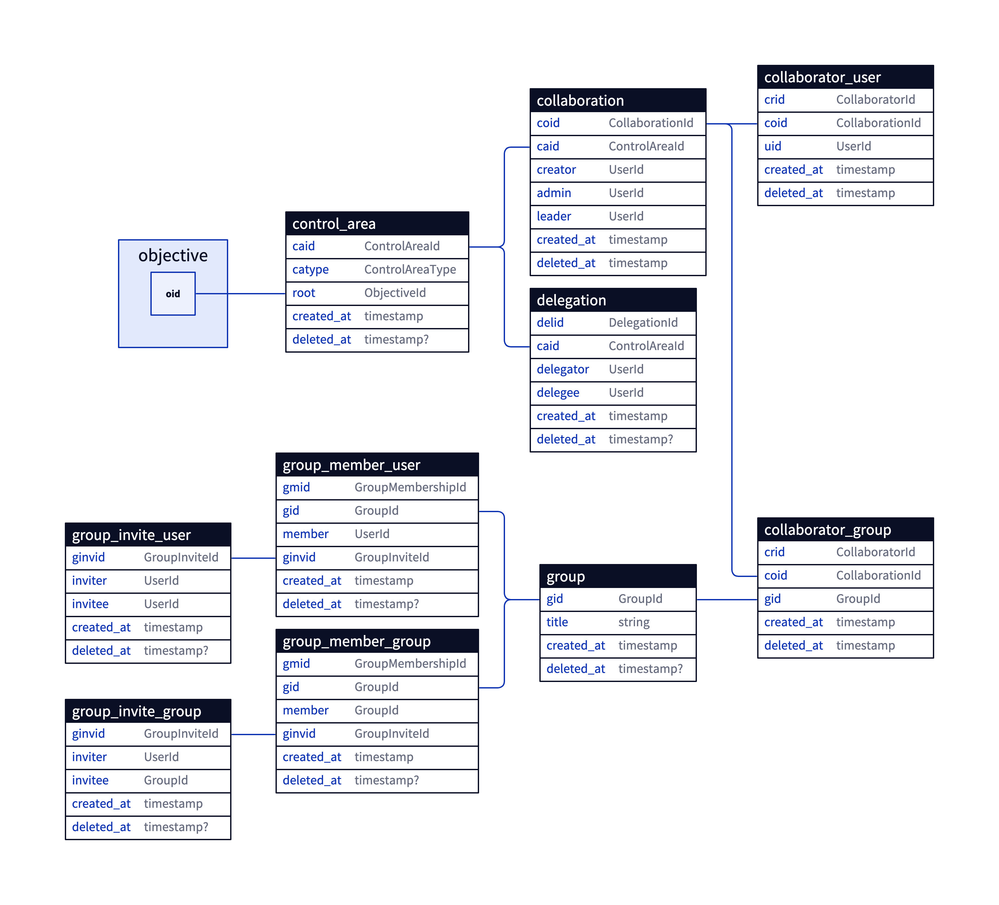

# Logbook database docs

## Document model: Versioned objectives

Design constraints

- **Scale**:
  - Balance the time complexity and storage need between: 
    - **write**: saving updates to db
    - **read**: building UI view for any version of a tree
- **Storage**: 
  - Taking full snapshots of document is impossible (So, event-sourcing)
- **Business**: 
  - `Documents` (trees) are only isolated by their root nodes. Any two document can share some subtrees (ownership is exclusive).
  - `Collaborator`s should be able to download only the changed parts rather than fully download or upload whole document at each sending/receiving change.
  - User should be free to `checkout` any version of any objective any time. 
  - `Checkouts` effect itself + subtree, and nothing else (ascendants, siblings).
  - Objectives get `properties` depending on either user-input or derived-statistics which their value depend on the subtree:
    - When an objective gets its `version` changed, `ascendants` should notice that to enable recalculation of `statistics` (`computed_to_top`, `computed_to_bottom`) and store statistics for any version of the tree isolatedly. (Never show outdated statistics to user)
  - `Collaboration config` (list of collaborators and permissions) of each objective is versioned independently from the content of objective and its subtree.

Key points of design:

- Objectives are individually versioned.

Design:

- Update of an objective saved as a new row `objective` table. The row gets the same `oid` but a newly generated `vid`.
- Updates are promoted to ascendants, saved as `op_transitive`.
- Promoted ascendant gets links to unchanged siblings. (therefore: Communal lands)
- Objectives and links are needed to be immutable. Because of when they are siblings of updated objectives they will be referred from different versions of the document in `link` table.

Pros:

- Balanced read/writes: 
  - Storage effective
  - Checkouts are fast (compared to event-sourcing)
- Allows separating tables:
  - One server:
    - Objective version -> version of props and privileges 
    - preciding versions
  - One server: 
    - Props
    - Statistics
    - Operations

Cons:

- Implementation complexity.
- Calculated props are only stored for the active version.
- View builder needs to know which versions are ahead of the active version after checking out to previous version, which might not scale well for big version history.
- Needs caching of views built for user-version since the information related to build views are distributed into tables.

### Promoting Updates

- Ascendants are individually versioned.
- Updates proprages. They trigger version iteration on the parent. Only the updated parent can link to new version of the objective.
- The siblings which are not updated, gets linked by the new version of parent, which is the reason of the `objective`'s being immutable and why `active` table exist.

### Communal lands and immutability

As the document model aims for the storage efficiency, unchanged parts of the tree (siblings, subtree/descendants etc.) never gets duplicated when an update occur for an objective. Thus, in the lifecycle of objectives, there is frequently occuring issue that any objective's any version may be referred by multiple version of the ascendants. 

Asserting immutability only solves the issue partially. But promoting each update to the right (active) ascendant is still crucial.

#### Active versions

Problem:

- As a result of any checkout, subtree gets referenced by current and last versions of the objective. So, we can't decide which version of parent we need to update with the updated subobjective.

Solution:

- Maintaining a table of `active_version` which consists by mutable rows pointing the active version of every checkout performed objective. 

- When an update is received on **direct child** of an checkout applied objective, the table is the direct source to tell which version receive the update.

- When an update is received on a descendant of a previously checked out objective, the method needs to traceback the link tree until it finds an ascendant has its active version marked in the table.

## View builder

Definition

- View builder is the linearization component for the hierarchically stored objectives, that generates an array of objectives that sit in the part of a document shown in the viewport of browser.

Design enablers

- Building the whole of document is almost never required.

Constraints:

- View builder needs the size of subtree of every node to be known for each version.

Design:

-	View builder should start comparing rows with only the latest version number 
-	As the parent node's version can never be older than its children's, view builder can pop the version numbers from version array when they are ahead of the held one, as it dig deeper. So, it can also postpone asking for the whole of version array, as it can fetch previous versions as it dig deeper and see another version than it holds
-	View builder may leverage `created_at` columns to quickly filter out ahead rows.

## Privileges

