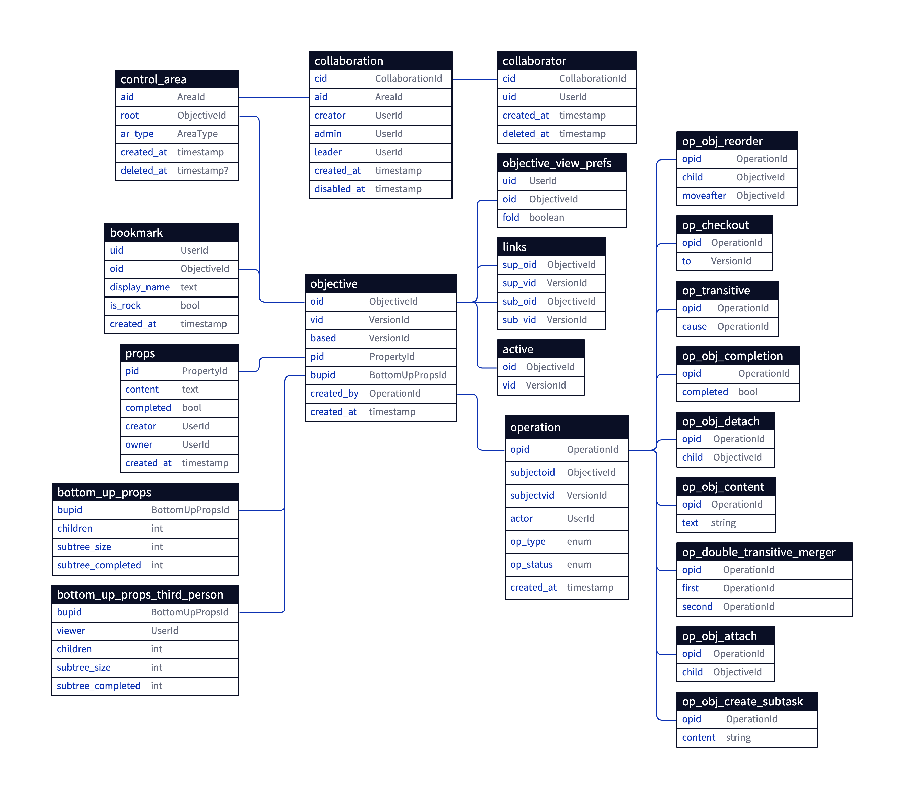

# Logbook database docs

## Document model

### Versioned documents

### Versioned trees

Design constraints

- Balance the time complexity and storage need between: 
  - **write**: saving changes into database for the next version, 
  - **read**: time to build a part of the document at any version
- Taking full snapshots of document is impossible (So, event-sourcing)
- Collaborators should be able to download only the changed parts rather than fully download or upload whole document at each sending/receiving change.

Design

- A content change in an objective gets saved as a new row in `objective` table with a new `vid` and same `oid`.
- Starting from the first parent of the updated objective, each ancestor gets a new row in the table with same `oid` but new `vid`.
- Objectives and links are needed to be immutable. Because of when they are siblings of updated objectives they will be referred from different versions of the document in `link` table.

Pros:

- Balanced read/writes: 
  - Storage effective
  - Checkouts are fast (compared to event-sourcing)

Cons:

- Implementation complexity.
- Calculated props are only stored for the active version.
- View builder needs to know which versions are ahead of the active version after checking out to previous version, which might not scale well for big version history.

## Distributed transactions

