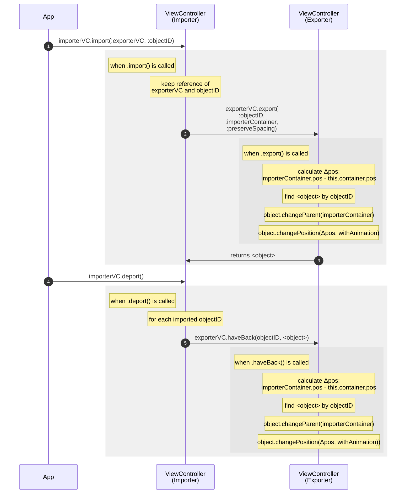
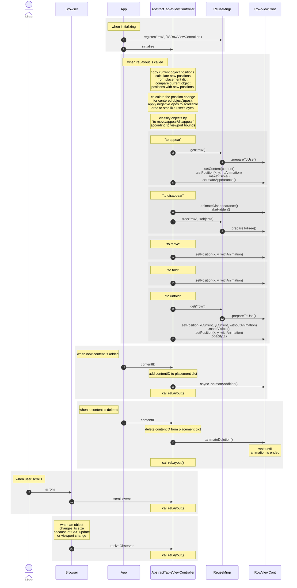
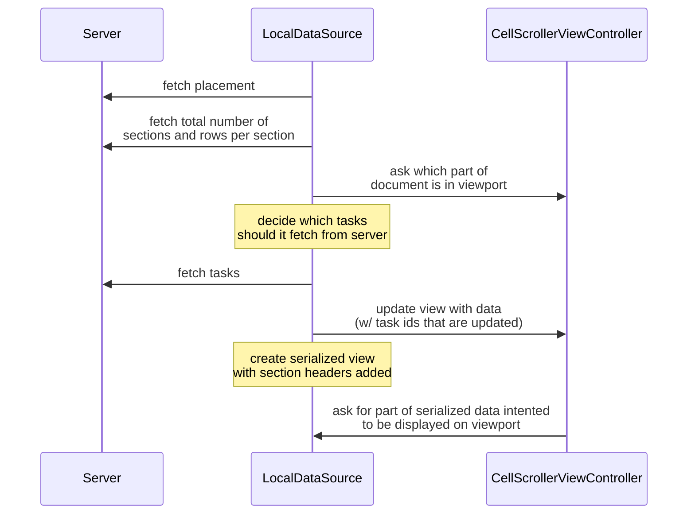

# Logbook Frontend

### `AbstractViewController`

```mermaid
sequenceDiagram

autonumber

participant app as App
participant impo as ViewController<br>(Importer)
participant expo as ViewController<br>(Exporter)

app->>impo: importerVC.import(:exporterVC, :objectID)
rect rgb(240,240,240)
  note left of impo: when .import() is called
  note over impo: keep reference of<br>exporterVC and objectID
  
  impo->>expo: exporterVC.export(<br>:objectID,<br>:importerContainer,<br>:preserveSpacing)
  rect rgb(230,230,230)
    note left of expo: when .export() is called
    note over expo: calculate Δpos:<br>importerContainer.pos - this.container.pos
    note over expo: find <object> by objectID
    note over expo: object.changeParent(importerContainer)
    note over expo: object.changePosition(Δpos, withAnimation)
  end
  expo->>impo: returns <object>
end

app->>impo: importerVC.deport()
rect rgb(240,240,240)
	note left of impo: when .deport() is called
  note over impo: for each imported objectID
  impo->>expo: exporterVC.haveBack(objectID, <object>)
  
  rect rgb(230,230,230)
    note left of expo: when .haveBack() is called
    note over expo: calculate Δpos:<br>importerContainer.pos - this.container.pos
    note over expo: find <object> by objectID
    note over expo: object.changeParent(importerContainer)
    note over expo: object.changePosition(Δpos, withAnimation))
  end
end
```

### `AbstractTableViewController(AbstractViewController)`

```mermaid
sequenceDiagram

autonumber

actor user as User
participant bro as Browser
participant app as App
participant inf as AbstractTableViewController
participant reuse as ReuseMngr
participant row as RowViewCont

rect rgb(240, 240, 240)
  note over app: when initializing
  app->>reuse: register("row", `ISRowViewController`)
  app->>inf: initialize
end

rect rgb(240, 240, 240)
  note left of inf: when reLayout is called
  note over inf: copy current object positions.<br>calculate new positions<br>from placement dict.<br>compare current object<br>positions with new positions.
  note over inf: calculate the position change<br>for centered object(Δpos).<br>apply negative Δpos to scrollable<br>area to stabilize user's eyes.
  note over inf: classify objects by <br>"to move/appear/disappear"<br>according to viewport bounds
  rect rgb(230, 230, 230) 
  	note over inf: "to appear"
  	inf->>reuse: .get("row")
  	reuse->>row: .prepareToUse()
  	inf->>row: .setContent(content)<br>.setPosition(x, y, noAnimation)<br>.makeVisible()<br>.animateAppearance()
  end
  rect rgb(230, 230, 230) 
  	note over inf:  "to disappear"
  	inf->>row: .animateDisappearance()<br>.makeHidden()
  	inf->>reuse: .free("row", <object>)
  	reuse->>row: .prepareToFree()
  end
  rect rgb(230, 230, 230) 
  	note over inf:  "to move"
  	inf->>row: .setPosition(x, y, withAnimation)
  end
  rect rgb(230, 230, 230) 
  	note over inf:  "to fold"
  	inf->>row: .setPosition(x, y, withAnimation)
  end
  rect rgb(230, 230, 230) 
  	note over inf:  "to unfold"
  	inf->>reuse: .get("row")
  	reuse->>row: .prepareToUse()
  	inf->>row: .setPosition(xCurrent, yCurrent, withoutAnimation)<br>.makeVisible()<br>.setPosition(x, y, withAnimation)<br>.opacity(1)
  end
end

rect rgb(240, 240, 240)
	note left of app: when new content is added
  app->>inf: contentID
  note over inf: add contentID to placement dict
  inf->>row: async .animateAddition()
  note over inf: call reLayout()
end

rect rgb(240, 240, 240)
	note left of app: when a content is deleted
  app->>inf: contentID
  note over inf: delete contentID from placement dict
  inf->>row: .animateDeletion()
  note over row: wait until<br>animation is ended
  note over inf: call reLayout()
end


rect rgb(240, 240, 240)
  note over user: when user scrolls
  user->>bro: scrolls
  bro->>inf: scroll event
  note over inf: call reLayout()
end


rect rgb(240, 240, 240)
  note over bro: when an object<br>changes its size<br>because of CSS update<br>or viewport change
  bro->>inf: resizeObserver
  note over inf: call reLayout()
end
```

## `Data Update sequence`

```mermaid
sequenceDiagram

participant s as Server
participant l as LocalDataSource
participant ui as CellScrollerViewController


l->>s: fetch placement
l->>s: fetch total number of<br>sections and rows per section
l->>ui: ask which part of<br>document is in viewport
note over l: decide which tasks<br>should it fetch from server
l->>s: fetch tasks
l->>ui: update view with data<br>(w/ task ids that are updated)
note over l: create serialized view<br>with section headers added
ui->>l: ask for part of serialized data intented<br>to be displayed on viewport
```

