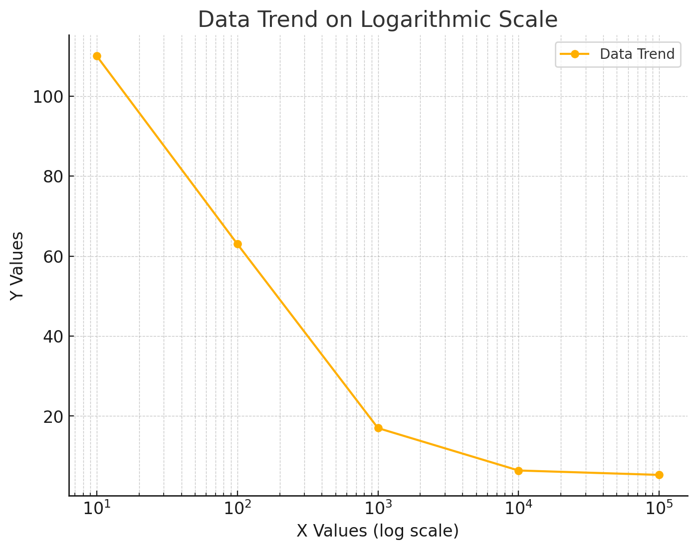
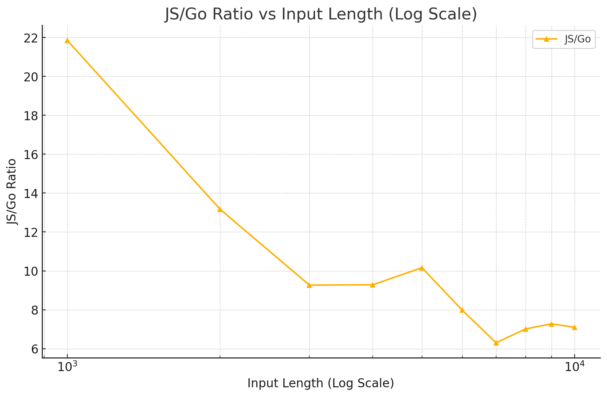

# Security

## Methodology

### Equalizer

An equalizer requires a client to spend significant effort to make a request to a service. Which reduces the weakness of server against automated requests.

**Criteria**

- **Effectiveness** - Solving the challenge must be more difficult than serving to an anonymous user
- **Frictionless** - User doesn't need to interact to pass the challenge.
- **Equality** - A JavaScript client should not have disadvantage against an attacker using 3rd-party client written in another language using an ASIC
- **Predictability** - Completion time should not vary too much between runs with same parameters
- **Adjustability** - The difficulty needs to be adjusted with minimal increments based on the volume of invalid requests originating from IPs/blocks.

**Design**

| Variable | Description          | Default |
| -------- | -------------------- | ------: |
| BL       | Batch Id length      |      40 |
| CPB      | Challenges per batch |      10 |
| ML       | Mask length          |      2+ |
| OL       | Original length      |      20 |
| PHL      | Pre-hash length      |    1000 |

Create

```python
alphabet = "012...ABC...abc..."
pseudo = "..."

def CreateChallenge(bid string, difficulty: number):
  original = randomstring(ML,      alphabet[:difficulty]) +
             randomstring(OL - ML, alphabet) +
  prehash = original + bid + pseudo[:PHL-BL-OL]
  hashed = hashfunction(prehash)
  masked = hashed[ML:]
  return (original, masked, hashed)

def CreateBatch(difficulty: number):
  bid = randomstring(BL, alphabet)
  return bid, [CreateChallenge(bid, difficulty) for _ in range(CPB)]
```

Solve

```python
alphabet = "012...ABC...abc..."

def SolveChallenge(difficulty: number, bid: string, masked: string, hashed: string):
  combination = combinate(ML, alphabet[:difficulty])
  for {
    prehash = combination + masked + bid + pseudo[:PHL-BL-OL]
    if hashfunction(prehash) == hashed {
      return combination
    }
    if !combination.iterate() {
      return nil
    }
  }

def SolveBatch(difficulty: number, bid: string, challenges: [](masked, hashed)):
  cs = {}
  for masked, hashed in challenges:
    combination = SolveChallenge(difficulty, bid, masked, hashed)
    if combination == NIL {
      return Error("failed for {combination}")
    }
    cs[hashed] = combination
  return cs
```

Validate

```python
def ValidateBatch(batchid: number, combinations: [](hashed, combination)):
  challenges, ok = store[batchid]
  if !ok:
    return Error("invalid batch id")
  if len(challenges) != len(combinations):
    return Error("wrong number of answers")
  if !compare_hashed_values(challenges, combinations):
    return Error("wrong questions")
  if compare_combinations(challenges, combinations):
    return Error("wrong answers")
  return nil
```

- **Challenges per batch**  
  It is picked as such to make sure the batch gets balanced selection of quick and slow challenges. Which the speed of solution determined by how late the solution is placed in the set of possible values. The algorithm doesn't contain logic to make sure equal number of early/late solutions by intention to not give attackers means to guess the direction for trials for sequent challenges.
- **Hash function**  
  outputs text that is in transport safe encoding. the result should be unguessable.
- **Alphabet limiting**  
  is applied only to the generation of masked part, to reduce weakness against rainbow tables.

**Review**

Increasing difficulty

| Growth      | Parameter                       | Example terms               |
| ----------- | ------------------------------- | --------------------------- |
| exponential | # of masked characters          | `ML^2`, `ML^3`, `ML^4`      |
| polynomial  | # of characters in the alphabet | `x^3`, `(x+1)^3`, `(x+2)^3` |
| linear      | # of challenges per batch       | `CPB`, `2CPB`, `3CPB`       |

> Increase the `CPB` against rest to reduce deviation in completion time.

> Increasing `CPB` over `ML` reduces the disparity between difficulties for the server to create challenges and the client to solve them.

**JavaScript penalty**

Found that a Go client can be far advantageous against a JS client for low input lengths in SHA-256 hashing.

<table>
<tr>
<td>

| Input length | JS (ms/hash) | Go (ms/hash) | JS/Go |
| ------------ | ------------ | ------------ | ----- |
| 10           | 0.0441       | 0.0004       | 110   |
| 100          | 0.0500       | 0.0008       | 63    |
| 1,000        | 0.0549       | 0.0032       | 17    |
| 10,000       | 0.1541       | 0.0240       | 6     |
| 100,000      | 1.3051       | 0.2432       | 5     |

</td>
<td>

</td>
</tr>
</table>

Zooming to `[1,000, 10,000]` range:

<table>
<tr>
<td>

| Input length | JS (ms/hash) | Go (ms/hash) | JS/Go |
| ------------ | ------------ | ------------ | ----- |
| 1,000        | 0.0590       | 0.0027       | 22    |
| 2,000        | 0.0698       | 0.0053       | 13    |
| 3,000        | 0.0695       | 0.0075       | 9     |
| 4,000        | 0.0882       | 0.0095       | 9     |
| 5,000        | 0.1199       | 0.0118       | 10    |
| 6,000        | 0.1134       | 0.0142       | 9     |
| 7,000        | 0.1197       | 0.0190       | 6     |
| 8,000        | 0.1304       | 0.0186       | 7     |
| 9,000        | 0.1448       | 0.0199       | 7     |
| 10,000       | 0.1604       | 0.0226       | 7     |

</td>
<td>

</td>
</tr>
</table>

Note: Values are for average of 100,000 iterations

Thus, pre-hash length is better to be as long as possible to reduce the disadvantage of JavaScript against 3rd party clients written in compiled languages since JS is what all of the legitimate visitors will be using. It has seen that the JS/Go ratio against input length looses its reduction rate significantly between 1,000 and 10,000. It makes 2,000 and 3,000 good choices for such purpose if the overhead of transfering longer text is considered.

Extension that will be made on the pre-hash input in this purpose have no need to kept as a secret, unique or unguessable. Even a pseudo public string suits.

**Transparency**

A form utilizes an equalizer may notify users about the usage through friendly text such:

> This form is made computationally difficult for browsers to make one valid submission in order to increase the cost of automated signups for attackers. This technic reduces the need to require users solve puzzles to prove they are not robots. [More info]()

## Measures

### Registration

**Concerns**

Failure on blocking automated account creation attempts may provide basis to:

- Abuse of free resources
- Denial of service
- Decreasing trust on userbase authenticty
- Manipulation of statistics on content popularity

**Available information**

There are not much information available throughout the registration to mark attackers:

- IP address
- Profile (name, surname, birthday, country)
- Contact (email, phone)

**Attacker classification**

Failed equalizer challenges in last hour, day, week etc.

**Setting rules**

When possible, generalize black list rules to limit their growth until degrees deciding a request become too expensive.

Use information to set black list rules:

- IP addresses

Consider using white listing:

- Emails with `.edu`, `.gov` tlds.
- Reputable email providers `gmail.com`, `outlook.com` (?)

**Penalties**

- Exponentially increase the equalizer challenge difficulty on marked IP blocks.

**Consequences**

Using shared IPs for registration is not supported.

## Backend

### Low level blocking

Application server maintains a log file which is also watched by fail2ban.

- The log file contains the failed attempts to perform API requests.

### User level rate limiting

### Authorization

#### PDP

The design shapes a **centralized** & **stateless** Policy Decision Point (PDP).

**Design constraints**

- **Verifiability**: Gather decision rules to one place to ease verifying implementation against requirements
- **Complex access control logic**: Due to collaboration and hierarchical groups
- **Distributed data**: Involved data in the decision process is too big and varying to gather in one place


